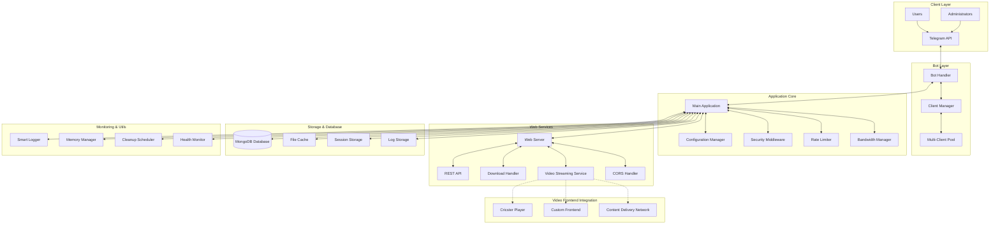
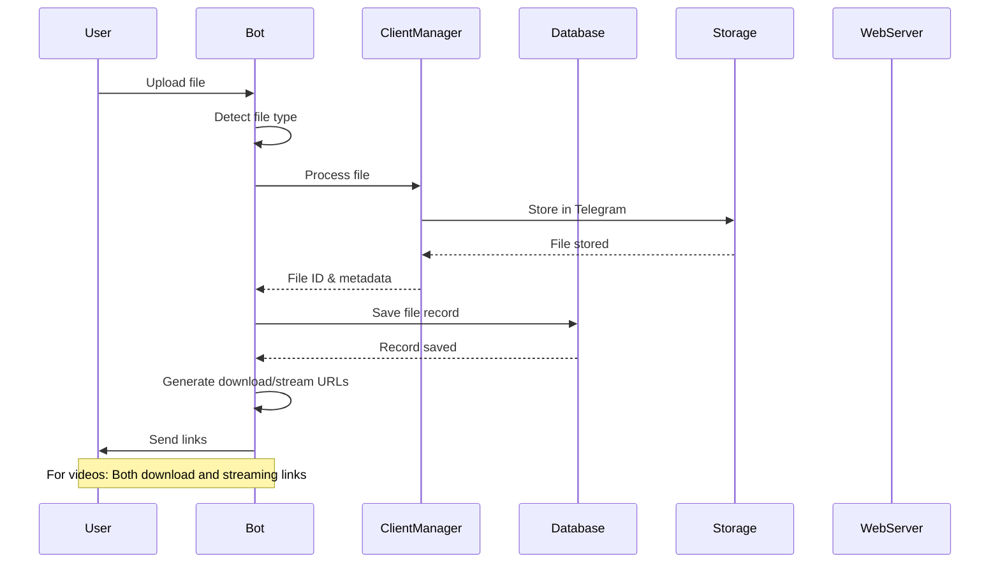
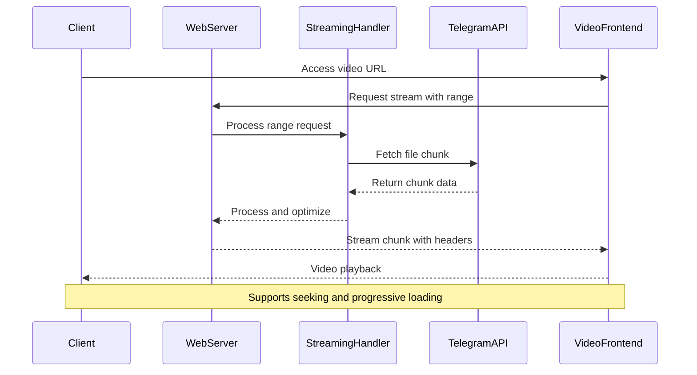
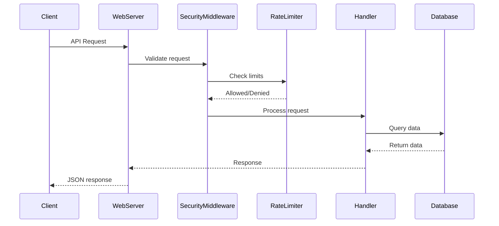

# StreamBot Architecture

StreamBot is built with a modern, scalable architecture designed for high-performance file downloads and video streaming. This document provides a comprehensive overview of the system's components, data flow, and technical implementation.

## System Overview



## Core Components

### 1. Application Entry Point

**Main Module** (`StreamBot/__main__.py`)
```python
# Application lifecycle management
- Environment validation and configuration loading
- Service initialization and dependency injection
- Graceful shutdown handling with cleanup
- Signal handling for production deployments
- Health check initialization
```

**Configuration Manager** (`StreamBot/config.py`)
```python
# Centralized configuration management
- Environment variable validation and parsing
- Video streaming configuration with Cricster defaults
- Python 3.11+ requirement enforcement
- Feature flag management
- Runtime configuration updates
```

### 2. Bot Layer Architecture

**Bot Handler** (`StreamBot/bot.py`)
```python
# Core bot functionality
class StreamBot:
    - Message processing and command handling
    - File upload detection and processing
    - Video format detection and optimization
    - Link generation for downloads and streaming
    - User interaction and response formatting
    - Admin command processing
    - Error handling and user feedback
```

**Client Manager** (`StreamBot/client_manager.py`)
```python
# Multi-client session management
class ClientManager:
    - Primary and secondary client coordination
    - Load balancing across multiple bot tokens
    - Connection pooling and optimization
    - Failover and redundancy handling
    - Session persistence and recovery
```

### 3. Web Services Layer

**Web Server** (`StreamBot/web/web.py`)
```python
# HTTP server implementation
class WebServer:
    - aiohttp-based async web server
    - Route registration and middleware setup
    - CORS configuration for video streaming
    - Request/response lifecycle management
    - Static file serving and optimization
```

**Video Streaming Service** (`StreamBot/web/streaming.py`)
```python
# Advanced video streaming implementation
class StreamingHandler:
    - HTTP range request processing
    - Video seeking and progressive loading
    - Multiple format support (MP4, MKV, AVI, WebM, MOV)
    - Bandwidth optimization and throttling
    - Frontend integration with URL parameters
    - Caching strategy and performance optimization
```

**Download Handler** (`StreamBot/web/`)
```python
# File download management
class DownloadHandler:
    - Direct file download processing
    - Range request support for large files
    - Resume capability implementation
    - Bandwidth tracking and limiting
    - Error handling and retry logic
```

### 4. Database Layer

**Database Manager** (`StreamBot/database/database.py`)
```python
# MongoDB operations and data management
class DatabaseManager:
    - User registration and management
    - File metadata storage and retrieval
    - Bandwidth usage tracking and analytics
    - Session management and persistence
    - Automatic cleanup and maintenance
```

**Data Models**:
```python
# User document structure
{
    "_id": ObjectId,
    "user_id": int,
    "username": str,
    "first_name": str,
    "join_date": datetime,
    "last_active": datetime,
    "bandwidth_used": int,
    "files_shared": int,
    "is_banned": bool
}

# File document structure
{
    "_id": ObjectId,
    "message_id": int,
    "user_id": int,
    "file_name": str,
    "file_size": int,
    "file_type": str,
    "mime_type": str,
    "is_video": bool,
    "upload_date": datetime,
    "download_count": int,
    "stream_count": int,
    "expires_at": datetime
}
```

### 5. Security Layer

**Security Middleware** (`StreamBot/security/middleware.py`)
```python
# Request/response security processing
class SecurityMiddleware:
    - Input validation and sanitization
    - Rate limiting enforcement
    - CORS policy implementation
    - Security header injection
    - Request logging and monitoring
```

**Rate Limiter** (`StreamBot/security/rate_limiter.py`)
```python
# Advanced rate limiting system
class RateLimiter:
    - Per-user request limiting
    - IP-based rate limiting
    - Bandwidth-aware throttling
    - Exponential backoff implementation
    - Whitelist and blacklist management
```

**Validator** (`StreamBot/security/validator.py`)
```python
# Input validation and security checks
class Validator:
    - File type validation
    - Size limit enforcement
    - Malicious content detection
    - URL validation for frontends
    - User permission verification
```

### 6. Utility Services

**Smart Logger** (`StreamBot/utils/smart_logger.py`)
```python
# Advanced logging system
class SmartLogger:
    - Structured logging with JSON format
    - Log level management and filtering
    - Performance metrics collection
    - Error tracking and alerting
    - Log rotation and archival
```

**Memory Manager** (`StreamBot/utils/memory_manager.py`)
```python
# Memory optimization and monitoring
class MemoryManager:
    - Memory usage tracking and optimization
    - Garbage collection management
    - Cache management and cleanup
    - Memory leak detection
    - Resource allocation monitoring
```

**Cleanup Scheduler** (`StreamBot/utils/cleanup_scheduler.py`)
```python
# Automated maintenance tasks
class CleanupScheduler:
    - Expired file cleanup
    - Database maintenance
    - Log file rotation
    - Session cleanup
    - Cache optimization
```

## Technology Stack

### Core Technologies

| Component | Technology | Version | Purpose |
|-----------|------------|---------|---------|
| **Runtime** | Python | 3.11+ | Core application language |
| **Bot Framework** | Pyrogram | 2.0+ | Telegram API integration |
| **Web Framework** | aiohttp | 3.8+ | HTTP server and client |
| **Database** | MongoDB | 4.4+ | Data persistence |
| **Async Runtime** | asyncio | Built-in | Asynchronous operations |

### Supporting Libraries

| Library | Purpose | Features |
|---------|---------|----------|
| **motor** | Async MongoDB driver | Non-blocking database operations |
| **aiofiles** | Async file operations | Efficient file I/O |
| **python-dotenv** | Environment management | Configuration loading |
| **psutil** | System monitoring | Resource usage tracking |
| **uvloop** | Performance optimization | Enhanced event loop |

## Data Flow Architecture

### File Upload Flow



### Video Streaming Flow



### API Request Flow



## Video Streaming Architecture

### Streaming Infrastructure

**Range Request Processing**:
```python
# HTTP range request handling
class RangeRequestHandler:
    - Parse range headers (bytes=start-end)
    - Validate range against file size
    - Stream partial content with 206 status
    - Support multiple range requests
    - Optimize chunk sizes for performance
```

**Video Format Support**:
- **Container Formats**: MP4, MKV, AVI, WebM, MOV, 3GP
- **Video Codecs**: H.264, H.265, VP8, VP9, AV1
- **Audio Codecs**: AAC, MP3, Opus, Vorbis
- **Streaming Protocols**: HTTP progressive download with range support

**Frontend Integration**:
```python
# Video frontend URL generation
def generate_video_url(stream_url, frontend_url):
    return f"{frontend_url}?stream={urllib.parse.quote(stream_url)}"

# Default: https://cricster.pages.dev?stream=...
# Custom: https://your-player.com?stream=...
```

### Performance Optimizations

**Caching Strategy**:
```python
# Multi-level caching implementation
- Browser caching with appropriate headers
- CDN integration for global distribution
- Application-level caching for metadata
- Database query optimization
- Memory-based session caching
```

**Bandwidth Management**:
```python
# Intelligent bandwidth allocation
- Per-user bandwidth tracking
- Quality-based streaming optimization
- Adaptive bitrate simulation
- Concurrent stream limiting
- Peak usage load balancing
```

## Security Architecture

### Multi-Layer Security

**Request Security**:
1. **Input Validation**: Comprehensive input sanitization
2. **Rate Limiting**: Multiple rate limiting strategies
3. **Authentication**: Encoded file ID security
4. **Authorization**: User permission verification
5. **Encryption**: HTTPS enforcement and secure headers

**File Security**:
```python
# File validation pipeline
class FileSecurityPipeline:
    - File type validation
    - Size limit enforcement
    - Malicious content scanning
    - Virus scanning integration (optional)
    - Content policy enforcement
```

**API Security**:
```python
# API protection mechanisms
- CORS policy enforcement
- Security header injection
- Request size limiting
- Response sanitization
- Error message sanitization
```

## Performance Characteristics

### Benchmarks and Capabilities

| Metric | Performance | Notes |
|--------|-------------|-------|
| **Concurrent Downloads** | 100+ per instance | With proper resource allocation |
| **Video Streams** | 50+ simultaneous | Depends on bandwidth and storage |
| **Response Time** | <100ms API calls | Excluding file transfer time |
| **Memory Usage** | 1-4 GB typical | Scales with concurrent operations |
| **CPU Usage** | 10-30% average | Spikes during file processing |
| **Database Ops** | 1000+ ops/sec | MongoDB with proper indexing |

### Scalability Patterns

**Horizontal Scaling**:
```python
# Multi-instance deployment
- Load balancer distribution
- Shared database cluster
- Session affinity handling
- Cross-instance communication
- Distributed caching
```

**Vertical Scaling**:
```python
# Resource optimization
- Worker process scaling
- Memory allocation tuning
- Database connection pooling
- Cache size optimization
- Concurrent operation limits
```

## Development Environment

### Local Development Setup

```python
# Development configuration
ENVIRONMENT = "development"
DEBUG = True
LOG_LEVEL = "DEBUG"
AUTO_RELOAD = True
DEVELOPMENT_FEATURES = True
```

### Testing Architecture

**Unit Testing**:
```python
# Test coverage areas
- Component isolation testing
- Mock external dependencies
- Database operation testing
- API endpoint validation
- Security feature testing
```

**Integration Testing**:
```python
# End-to-end testing
- Full workflow testing
- Multi-client scenarios
- Video streaming validation
- Performance benchmarking
- Error condition handling
```

## Deployment Architecture

### Production Deployment

**Container Architecture**:
```yaml
# Docker composition
services:
  streambot:
    - Application container
    - Health check endpoints
    - Resource limits
    - Environment configuration
    - Volume mounts for persistence
  
  mongodb:
    - Database container
    - Data persistence
    - Backup configuration
    - Performance tuning
    - Security hardening
```

**Monitoring Integration**:
```python
# Production monitoring
- Health check endpoints
- Metrics collection
- Error tracking
- Performance monitoring
- Alerting configuration
```

## Future Architecture Considerations

### Planned Enhancements

**Microservices Migration**:
- Service decomposition strategy
- API gateway implementation
- Service mesh integration
- Independent scaling capabilities
- Fault isolation improvements

**Advanced Video Features**:
- Adaptive bitrate streaming
- Video transcoding pipeline
- Quality optimization
- CDN integration
- Edge caching strategies

**Enhanced Security**:
- End-to-end encryption
- Advanced threat detection
- Audit logging system
- Compliance frameworks
- Zero-trust architecture

## Repository Information

**GitHub Repository**: [https://github.com/AnikethJana/Telegram-Download-Link-Generator](https://github.com/AnikethJana/Telegram-Download-Link-Generator)

**Architecture Documentation**: This document is part of the comprehensive StreamBot documentation suite.

For implementation details, see:
- [Installation Guide](../getting-started/installation.md)
- [Configuration Reference](../getting-started/configuration.md)
- [API Documentation](../api/overview.md)
- [Contributing Guide](contributing.md) 