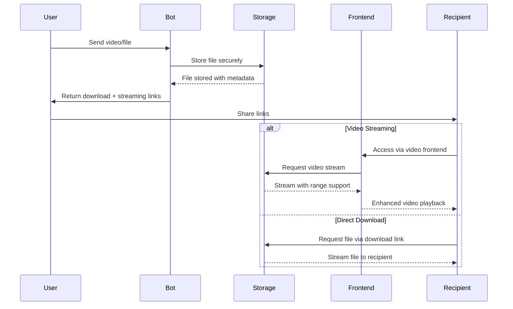

# Introduction to StreamBot

StreamBot is a powerful Telegram bot that generates direct download links and streaming URLs for files sent to it. Beyond simple file sharing, StreamBot offers advanced video streaming capabilities with seeking support, making it ideal for sharing media content through Telegram without requiring recipients to have a Telegram account.

## What StreamBot Does

StreamBot solves multiple file sharing challenges: sharing large files through Telegram and providing seamless video streaming experiences. When you send a file to StreamBot, it:

1. **Processes files securely** with automatic format detection
2. **Stores files** using Telegram's robust infrastructure  
3. **Generates direct download links** for universal access
4. **Creates streaming URLs** for video files with seeking support
5. **Integrates with video frontends** (defaults to Cricster player)
6. **Manages bandwidth and download limits** with real-time tracking
7. **Tracks detailed usage statistics** for monitoring and optimization

## Key Benefits

- :material-play-circle:{ .lg .middle } **Video Streaming**

    ---

    Advanced video streaming with seeking support, range requests, and custom frontend integration including default Cricster player.

- :material-rocket-launch:{ .lg .middle } **High Performance**

    ---

    Multi-client architecture with Python 3.11+ optimization ensures fast processing and downloads even under heavy load.

- :material-shield-lock:{ .lg .middle } **Controlled Access**

    ---

    Configure download limits, rate limiting, bandwidth quotas, and optional force subscription for greater control.

- :material-chart-line:{ .lg .middle } **Usage Monitoring**

    ---

    Track bandwidth usage, streaming statistics, user analytics, and system performance in real-time.

- :material-api:{ .lg .middle } **REST API**

    ---

    Comprehensive REST API with streaming endpoints allows integration with your applications and services.

- :material-television:{ .lg .middle } **Frontend Integration**

    ---

    Seamless integration with video frontends including default Cricster support and custom player development.

## Who Should Use StreamBot

StreamBot is ideal for:

- **Content Creators** sharing video content and media files with audiences
- **Educators** distributing course materials and instructional videos
- **Businesses** sharing presentations, documents, and training videos with clients
- **Developers** sharing builds, demos, or large code packages
- **Media Teams** distributing video content with professional playback experience
- **Communities** managing file and video distribution with controlled access
- **Personal Users** who want simple file sharing and video streaming with friends and family

## How It Works

## Video Streaming Features

StreamBot's advanced video streaming capabilities include:

### 🎬 **Streaming Infrastructure**
- **Range Request Support**: Full HTTP range request implementation for instant seeking
- **Progressive Loading**: Start playback while video is still downloading
- **Multiple Format Support**: MP4, MKV, AVI, WebM, MOV, and more
- **Adaptive Quality**: Automatic quality detection and optimization

### 🖥️ **Frontend Integration**  
- **Default Cricster Integration**: Professional video player at `https://cricster.pages.dev`
- **Custom Frontend Support**: Build and integrate your own video players
- **URL Parameter Format**: `{frontend_url}?stream={encoded_stream_url}`
- **Cross-Platform Compatibility**: Works on desktop, mobile, and tablets

### ⚡ **Performance Optimizations**
- **Seeking Support**: Jump to any point in videos instantly
- **Bandwidth Efficiency**: Optimized streaming protocols
- **Concurrent Streaming**: Support for multiple simultaneous streams
- **Caching Strategy**: Smart caching for improved performance

## Getting Started

Ready to get started with StreamBot? The next sections will guide you through:

1. [Installation](installation.md) - Complete setup with Python 3.11+ requirements
2. [Configuration](configuration.md) - Configure bot with video streaming options
3. [Quick Start](quick-start.md) - Test file sharing and video streaming features

## Features at a Glance

| Feature | Description | Video Support |
|---------|-------------|---------------|
| **Direct Download Links** | Generate shareable links for any file | ✅ All formats |
| **Video Streaming** | Stream videos with seeking and frontend integration | ✅ Enhanced experience |
| **Multi-Client Support** | Distribute load across multiple Telegram clients | ✅ Better performance |
| **Bandwidth Management** | Track and limit bandwidth with streaming analytics | ✅ Separate tracking |
| **Rate Limiting** | Control access frequency per user with stream quotas | ✅ Stream-aware limits |
| **Force Subscription** | Require users to join channels before using the bot | ✅ Works with streaming |
| **Admin Commands** | Monitor and manage bot with streaming statistics | ✅ Enhanced admin tools |
| **REST API** | Integrate with streaming endpoints and video data | ✅ Streaming API |
| **Automatic Cleanup** | Maintain system resources with stream management | ✅ Stream cleanup |
| **Frontend Integration** | Default Cricster + custom video player support | ✅ Video-specific |

## System Requirements

### Minimum Requirements
- **Python**: 3.11 or higher (required for optimal performance)
- **MongoDB**: 4.4+ for data persistence
- **RAM**: 1 GB minimum (2 GB+ recommended for video streaming)
- **Storage**: 10 GB minimum for application and caching
- **Bandwidth**: 100 Mbps minimum (1 Gbps+ recommended for HD streaming)

### Video Streaming Recommendations
- **CPU**: 2+ cores for concurrent video processing
- **RAM**: 4 GB+ for multiple simultaneous streams
- **Network**: High bandwidth for quality video streaming experience
- **Storage**: SSD recommended for better I/O performance

## Next Steps

Proceed to the [Installation Guide](installation.md) to set up your own StreamBot instance with full video streaming capabilities. Make sure to review the [Configuration Guide](configuration.md) to properly set up video frontend integration and streaming optimizations. 