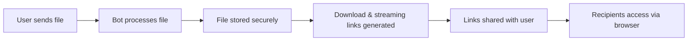

# User Guide Overview

StreamBot is designed to be simple yet powerful. This guide covers all features including the new advanced video streaming capabilities and how to use them effectively.

## Core Functionality

### File to Link Conversion

StreamBot's primary function is converting files sent via Telegram into direct download links and streaming URLs that can be shared with anyone.



### Supported File Types

StreamBot supports all file types that Telegram accepts:

- **Documents**: PDF, DOCX, TXT, ZIP, etc.
- **Images**: JPG, PNG, GIF, WebP, etc.
- **Videos**: MP4, MKV, AVI, WebM, MOV, etc. (with streaming support)
- **Audio**: MP3, FLAC, OGG, etc.
- **Archives**: ZIP, RAR, 7Z, etc.
- **Any other file type** up to Telegram's size limits

## Video Streaming Features

### Advanced Video Streaming

StreamBot now includes comprehensive video streaming capabilities:

- **Direct Video Streaming**: Stream videos directly in browsers without downloading
- **Seeking Support**: Jump to any point in the video with full range request support
- **Multiple Formats**: Support for MP4, MKV, AVI, WebM, MOV, and more
- **Frontend Integration**: Custom video player frontend support (defaults to Cricster)
- **Cross-Platform**: Works on desktop and mobile browsers
- **Efficient Loading**: Range requests for optimal video loading

### Video Frontend Integration

By default, StreamBot integrates with Cricster video frontend:

```
Video Frontend URL: https://cricster.pages.dev
Final URL Format: {VIDEO_FRONTEND_URL}?stream={encoded_stream_url}
```

**Features of default frontend:**
- Modern video player interface
- Seeking controls and timeline
- Volume controls and settings
- Fullscreen support
- Mobile-responsive design
- Keyboard shortcuts support

### Custom Video Frontend

You can build your own video frontend to work with StreamBot:

```javascript
// Example: Extract stream URL from query parameter
const urlParams = new URLSearchParams(window.location.search);
const streamUrl = urlParams.get('stream');

// Use the stream URL in your video player
const videoElement = document.getElementById('video');
videoElement.src = streamUrl;
```

**URL Parameter Structure:**
- Parameter name: `stream`
- Value: URL-encoded streaming URL
- Example: `https://your-frontend.com?stream=https%3A//yourdomain.com/stream/abc123`

## Basic Usage

### Getting Started

1. **Find your bot** on Telegram (search for your bot's username)
2. **Send `/start`** to begin using the bot
3. **Send any file** to generate download and streaming links
4. **Share the links** with anyone who needs access

### File Upload Process

1. **Send a file** to the bot via Telegram
2. **Wait for processing** (usually instant for small files)
3. **Receive links** in the chat:
   - Direct download link
   - Streaming link (for videos)
   - "🎬 Play Video" button (for videos with frontend configured)
4. **Copy and share** the links as needed

### Download vs Streaming Links

**Download Links:**
```
https://yourdomain.com/dl/encoded_file_id
```
- Direct file download
- Full file transfer
- Works for all file types

**Streaming Links:**
```
https://yourdomain.com/stream/encoded_file_id
```
- Progressive video streaming
- Seeking support
- Range requests supported
- Optimized for video playback

## User Commands

### Basic Commands

| Command | Description | Example |
|---------|-------------|---------|
| `/start` | Welcome message and bot info | `/start` |
| `/help` | Show available commands | `/help` |
| `/info` | Bot statistics and status | `/info` |

### Information Commands

| Command | Description | Access |
|---------|-------------|--------|
| `/stats` | Personal usage statistics | All users |
| `/ping` | Check bot responsiveness | All users |

## Features in Detail

### Rate Limiting

StreamBot implements rate limiting to prevent abuse:

- **Daily limits** on link generation (configurable)
- **Per-user tracking** of usage
- **Automatic reset** at midnight UTC
- **Graceful handling** when limits are reached

!!! info "Rate Limit Reached"
    When you reach your daily limit, the bot will inform you how long until reset.

### Bandwidth Management

Monitor and control data usage:

- **Monthly bandwidth tracking** with automatic reset
- **Global bandwidth limits** (configurable)
- **Real-time usage statistics** via `/stats` command
- **Automatic cleanup** of old usage data (keeps 3 months)
- **Protected current month data** - cleanup never affects current month
- **Efficient stream tracking** with automatic cleanup of stale connections

### System Management

Automated cleanup and monitoring:

- **Stream cleanup** runs every 10 minutes to remove stale connections
- **Memory cleanup** runs hourly to optimize resource usage  
- **Bandwidth cleanup** runs daily to remove old records
- **Maximum stream age** of 4 hours for large file downloads
- **Accurate stream counting** prevents resource leaks

### Force Subscription

If enabled, users must join specified channels before using the bot:

- **Channel verification** before each use
- **Automatic checking** of membership status
- **Graceful prompts** to join required channels
- **Multiple channels** can be required

### Link Expiration

Optional link expiration for enhanced security:

- **Configurable expiration time** (default: 24 hours)
- **Applies to both download and streaming links**
- **Automatic cleanup** of expired links
- **Clear expiration notices** in generated links
- **Can be disabled** for permanent links

## Admin Features

### Admin Commands

| Command | Description | Usage |
|---------|-------------|-------|
| `/stats` | System statistics with memory, streams, and bandwidth | `/stats` |
| `/logs` | View application logs | `/logs level=ERROR limit=50` |
| `/broadcast` | Send message to all users | Reply to message with `/broadcast` |

### System Statistics

Admins can view comprehensive system information:

- **Memory Usage**: RSS, VMS, percentage
- **Active Resources**: Stream count, client count
- **Bandwidth Usage**: Monthly usage and limits
- **Logger Cache**: Current cache status
- **Uptime**: System uptime information

### Log Access

Admins can access detailed logs:

```
/logs level=INFO limit=100
/logs level=ERROR limit=50
/logs filter=download
/logs filter=streaming
```

**Log Levels**: `DEBUG`, `INFO`, `WARNING`, `ERROR`, `CRITICAL`

### Broadcasting

Send announcements to all bot users:

1. **Compose your message** in Telegram
2. **Reply to it** with `/broadcast`
3. **Confirm** when prompted
4. **Message sent** to all users

## API Access

### Public Endpoints

Anyone can access these endpoints:

| Endpoint | Description | Video Support |
|----------|-------------|---------------|
| `GET /api/info` | Retrieve bot status and basic information | ✅ Shows video streaming status |
| `GET /dl/{file_id}` | Download files via generated links | ✅ Range requests supported |
| `GET /stream/{file_id}` | Stream video files | ✅ Full streaming with seeking |

### Example API Usage

```bash
# Get bot information
curl https://yourdomain.com/api/info

# Download a file
curl -O https://yourdomain.com/dl/encoded_file_id

# Stream a video with range request
curl -H "Range: bytes=0-1048576" https://yourdomain.com/stream/encoded_file_id
```

### Health Check

You can use the `/api/info` endpoint as a basic health check for both download and streaming services.

## Video Streaming Usage

### Supported Video Formats

**Container Formats:**
- MP4, MKV, AVI, WebM, MOV
- 3GP, M4V, WMV

**Video Codecs:**
- H.264 (AVC), H.265 (HEVC)
- VP8, VP9, AV1
- MPEG-4, DivX, XviD

**Audio Codecs:**
- AAC, MP3, Opus
- Vorbis, FLAC, AC3

### Streaming Performance

**Optimization Features:**
- **Range Requests**: Load only needed video segments
- **Efficient Buffering**: Smart buffering for smooth playback
- **Seeking Support**: Instant seeking to any video position
- **Progressive Loading**: Start playback while downloading

### Browser Compatibility

**Desktop Browsers:**
- Chrome 80+, Firefox 75+, Safari 13+, Edge 80+

**Mobile Browsers:**
- Chrome Mobile, Safari Mobile, Samsung Internet

**Video Player Features:**
- Fullscreen support
- Picture-in-picture mode
- Keyboard shortcuts
- Touch controls (mobile)

## Troubleshooting

### Common Issues

!!! question "Bot doesn't respond to commands"
    **Possible causes:**
    - Bot is offline or restarting
    - You're not in a private chat with the bot
    - Bot is experiencing high load
    
    **Solutions:**
    - Wait a few minutes and try again
    - Check bot status at `/api/info`
    - Contact administrator

!!! question "File upload fails"
    **Possible causes:**
    - File too large (>2GB for Telegram)
    - Rate limit reached
    - Bandwidth limit exceeded
    - Bot storage issues
    
    **Solutions:**
    - Check file size limits
    - Wait for rate limit reset
    - Try again later
    - Contact administrator if persistent

!!! question "Download links don't work"
    **Possible causes:**
    - Link has expired
    - Server is down
    - Network connectivity issues
    - File was removed
    
    **Solutions:**
    - Generate a new link
    - Check server status
    - Try from different network
    - Contact administrator

!!! question "Video streaming doesn't work"
    **Possible causes:**
    - Video format not supported
    - Frontend URL not accessible
    - Network connectivity issues
    - Browser compatibility issues
    
    **Solutions:**
    - Try different video format
    - Check VIDEO_FRONTEND_URL configuration
    - Test in different browser
    - Use download link as fallback

!!! question "Can't access admin features"
    **Possible causes:**
    - Not configured as admin
    - Invalid permissions
    
    **Solutions:**
    - Check admin configuration
    - Verify user ID in ADMINS setting

### Error Messages

| Error | Meaning | Solution |
|-------|---------|----------|
| "Rate limit exceeded" | Too many requests | Wait for reset time |
| "File too large" | Exceeds size limits | Use smaller file |
| "Bandwidth exceeded" | Monthly limit reached | Wait for monthly reset |
| "Join required channels" | Subscription required | Join specified channels |
| "Link expired" | Download/streaming link invalid | Generate new link |
| "Video streaming unavailable" | Frontend not configured | Check VIDEO_FRONTEND_URL |

### Getting Support

If you need help:

1. **Check this documentation** for common solutions
2. **Review error messages** carefully
3. **Test with different files** to isolate issues
4. **Contact administrators** via configured support channels
5. **Report bugs** on [GitHub Issues](https://github.com/AnikethJana/Telegram-Download-Link-Generator/issues)
6. **Get help** on [Telegram](https://t.me/ajmods_bot)

## Best Practices

### For Users

- **Use descriptive filenames** for better organization
- **Check file sizes** before uploading large files
- **Share links responsibly** and only with intended recipients
- **Monitor your usage** to avoid hitting limits
- **Keep download links secure** if they contain sensitive content
- **Test video streaming** before sharing streaming links
- **Use appropriate video formats** for better streaming performance

### For Administrators

- **Set appropriate limits** based on your server capacity
- **Monitor system resources** regularly using `/stats`
- **Keep software updated** for security and features
- **Backup configuration** and database regularly
- **Review logs** for unusual activity
- **Configure video frontend** properly for best user experience
- **Test streaming functionality** regularly
- **Monitor bandwidth usage** to prevent overages

## Advanced Usage

### Multiple File Sharing

For sharing multiple files:

1. **Create an archive** (ZIP, RAR, etc.) containing all files
2. **Upload the archive** to get a single download link
3. **Share the archive link** instead of multiple individual links

### Video Streaming Integration

Use the streaming API to integrate StreamBot with your applications:

- **Automated video hosting** for your services
- **Programmatic streaming link generation** via API calls
- **Custom video player integration** with your frontend
- **Status monitoring** for streaming service health

### Custom Frontend Development

Build your own video frontend:

```html
<!DOCTYPE html>
<html>
<head>
    <title>Custom Video Player</title>
</head>
<body>
    <video id="videoPlayer" controls width="100%">
        Your browser does not support the video tag.
    </video>
    
    <script>
        // Get stream URL from query parameter
        const urlParams = new URLSearchParams(window.location.search);
        const streamUrl = urlParams.get('stream');
        
        if (streamUrl) {
            document.getElementById('videoPlayer').src = streamUrl;
        }
    </script>
</body>
</html>
```

This completes the comprehensive user guide overview with full video streaming capabilities. For specific features, see the dedicated sections in this guide. 